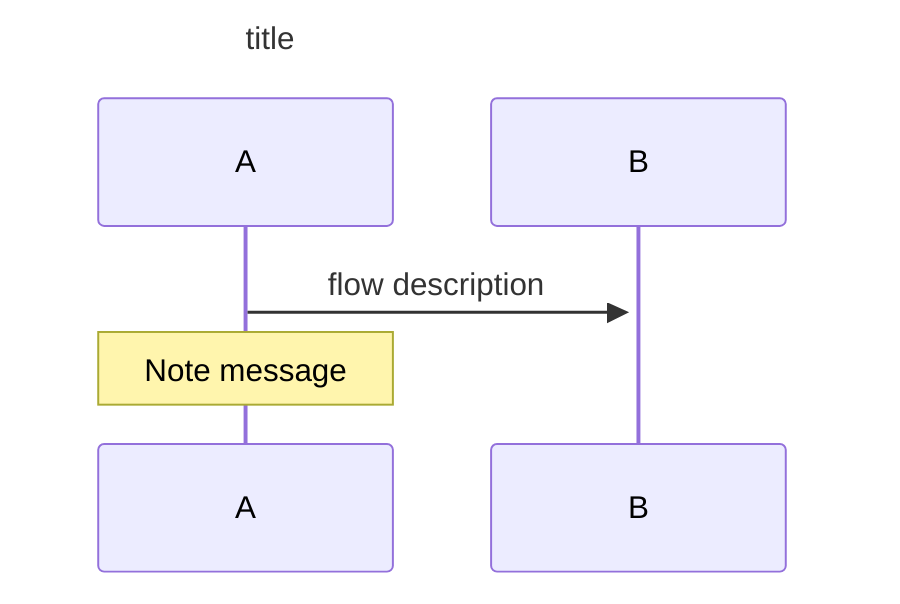
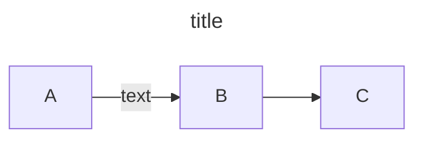
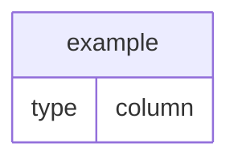

- [需求說明](#需求說明)
- [需求分析](#需求分析)
- [流程圖](#流程圖)
- [資料來源](#資料來源)
- [畫面](#畫面)
- [資料庫結構](#資料庫結構)

---

# 需求說明
- 名稱
- 概述
- 日期


# 需求分析
```
需求分析文字敘述
```

# 流程圖
```
https://mermaid.js.org/syntax/examples.html
```

sequenceDiagram

graph


# 資料來源
```
需要的資料怎麼來, whiich table/api
```

# 畫面


# 資料庫結構

